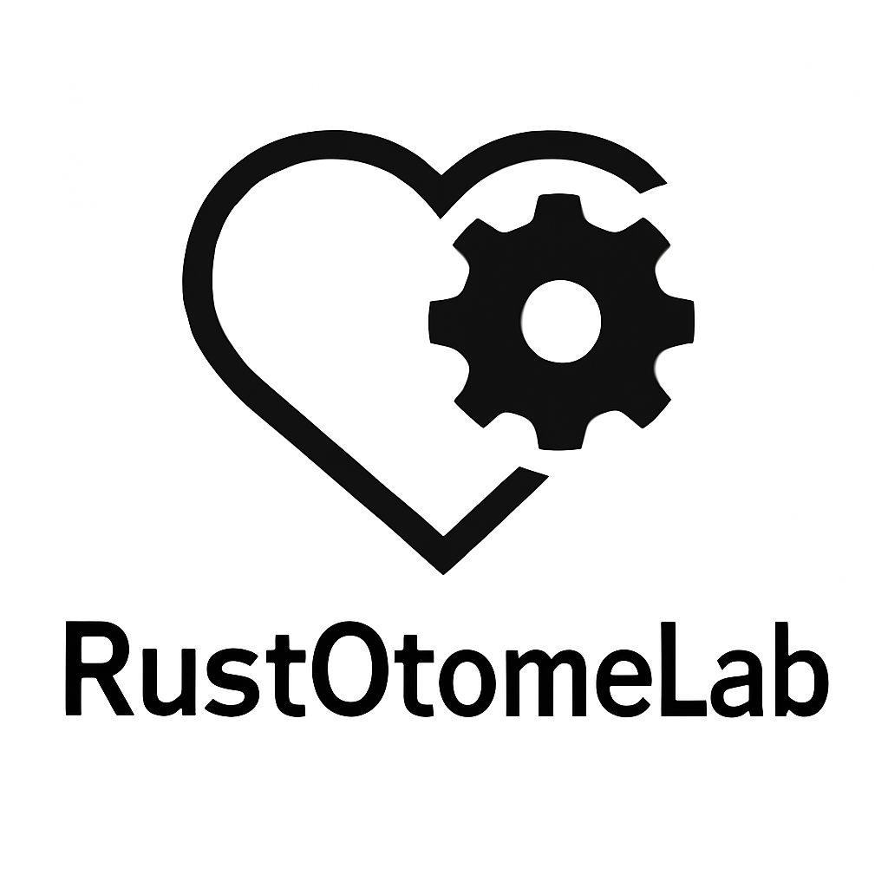

# ❤️RustEng —— A Rust-based GalGame Engine

[简体中文](README.md) | English | [日本語](README_ja.md)

## ❓Introduction

As the name suggests, this is a **GalGame** game engine based on **Rust**, providing common features such as scene switching and story progression.

## ✅Implemented Features

* Background images
* Subtitles
* Voice-overs
* BGM
* Character sprites and expressions
* Auto-play
* Branching choices
* History log and navigation
* Save and load
* Resize window while maintaining aspect ratio
* Fullscreen toggle with F11 shortcut

## 🔳Planned Features
#### For details, see: [Issue：Roadmap](https://github.com/RustOtomeLab/RustEng/issues/13)

## 📘Documentation (How to Use RustEng)

* [Scene Script Documentation](docs/en_US/how_to_use_script.md)
* [Configuration File Documentation](docs/en_US/how_to_use_config.md)

> [!IMPORTANT]
> This repository includes two test script files and other test resources. You can also prepare your own test files. Please refer to the two documents above for file requirements.

#### *🌟 Give it a star if you like it!*
